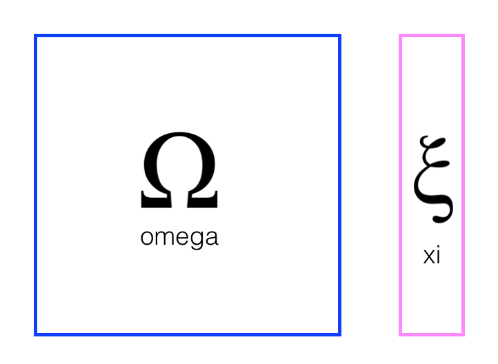

# Landmark-Detection-Robot-Tracking-SLAM
---

## Project Overview

In this project, i have implemented SLAM for robot that moves and senses in a 2 dimensional, grid world

SLAM gives us a way to both localize a robot and build up a map of its environment as a robot moves and senses in real-time. This is an active area of research in the fields of robotics and autonomous systems. Since this localization and map-building relies on the visual sensing of landmarks, this is a computer vision problem. 

## Omega and Xi

To implement Graph SLAM, a matrix and a vector (omega and xi, respectively) are introduced. The matrix is square and labelled with all the robot poses (xi) and all the landmarks (Li). Every time you make an observation, for example, as you move between two poses by some distance `dx` and can relate those two positions, you can represent this as a numerical relationship in these matrices.

It's easiest to see how these work in an example. Below you can see a matrix representation of omega and a vector representation of xi.

Next, let's look at a simple example that relates 3 poses to one another. 
* When you start out in the world most of these values are zeros or contain only values from the initial robot position
* In this example, you have been given constraints, which relate these poses to one another
* Constraints translate into matrix values

### Solving for x

To "solve" for all these x values, we can use linear algebra; all the values of x are in the vector `mu` which can be calculated as a product of the inverse of omega times xi.

---

## Motion Constraints and Landmarks

Let's look at how motion (and similarly, sensor measurements) can be used to create constraints and fill up the constraint matrices, omega and xi. Let's start with empty/zero matrices.

This example also includes relationships between poses and landmarks. Say we move from x0 to x1 with a displacement `dx` of 5. Then we have created a motion constraint that relates x0 to x1, and we can start to fill up these matrices.

In fact, the one constraint equation can be written in two ways. So, the motion constraint that relates x0 and x1 by the motion of 5 has affected the matrix, adding values for *all* elements that correspond to x0 and x1.

---
## Initialize Constraints

One of the most challenging tasks here will be to create and modify the constraint matrix and vector: omega and xi. In the second notebook, you saw an example of how omega and xi could hold all the values the define the relationships between robot poses `xi` and landmark positions `Li` in a 1D world, as seen below, where omega is the blue matrix and xi is the pink vector.

In *this* project, you are tasked with implementing constraints for a 2D world. We are referring to robot poses as `Px, Py` and landmark positions as `Lx, Ly`, and one way to approach this challenge is to add *both* x and y locations in the constraint matrices.

You may also choose to create two of each omega and xi (one for x and one for y positions).

---

## SLAM inputs 

In addition to `data`, your slam function will also take in:
* N -   The number of time steps that a robot will be moving and sensing
* num_landmarks - The number of landmarks in the world
* world_size - The size (w/h) of your world
* motion_noise - The noise associated with motion; the update confidence for motion should be `1.0/motion_noise`
* measurement_noise - The noise associated with measurement/sensing; the update weight for measurement should be `1.0/measurement_noise`

#### A note on noise

Recall that `omega` holds the relative "strengths" or weights for each position variable, and you can update these weights by accessing the correct index in omega `omega[row][col]` and *adding/subtracting* `1.0/noise` where `noise` is measurement or motion noise. `Xi` holds actual position values, and so to update `xi` you'll do a similar addition process only using the actual value of a motion or measurement. So for a vector index `xi[row][0]` you will end up adding/subtracting one measurement or motion divided by their respective `noise`.